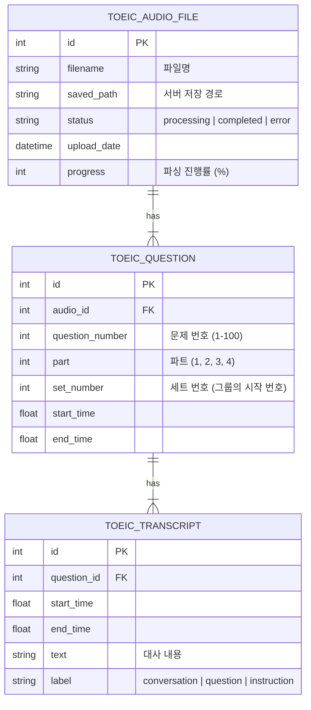

# TOEIC Whisper DB 스키마 구조

현재 시스템의 데이터베이스 구조와 데이터 저장 흐름을 설명하는 문서입니다.

## ER Diagram (Entity Relationship Diagram)

## 데이터 구조 설명

### 1. ToeicAudioFile (오디오 파일)
- 업로드된 **MP3 파일 하나**에 해당합니다.
- `status`: 현재 파싱 진행 상태를 나타냅니다.

### 2. ToeicQuestion (문제)
- LC 시험의 **개별 문제 하나**를 의미합니다. (총 100문제)
- `part`: 해당 문제가 속한 파트(Part 1~4)입니다.
- **`set_number` (핵심)**: Part 3, 4와 같이 **하나의 대화문에 여러 문제가 딸린 경우**를 처리합니다.
    - 예: Questions 4-6이 하나의 대화문이라면, 문제 4, 5, 6번의 `set_number`는 모두 **4**가 됩니다.
    - 이를 통해 프론트엔드에서 "4, 5, 6번 문제는 같은 대화문이니 묶어서 보여주자"라고 판단합니다.

### 3. ToeicTranscript (대본)
- 각 문제에 나뉘어 배정된 **대사 한 줄 한 줄**입니다.
- **`label` (핵심)**: 대사의 성격을 구분합니다.
    - `conversation`: 실제 지문/대화 내용 (화면에 크게 보여줄 내용)
    - `question`: 성우가 문제를 읽어주는 멘트 (예: "Number 4. What does the man wants to do?")
    - `instruction`: "Questions 4 through 6 refer to following conversation" 같은 안내 멘트

## 데이터 저장 예시 (Part 3 로직)

**상황**: "Questions 32 through 34 refer to the following conversation." 멘트 후 남녀 대화가 나오고, 문제 32, 33, 34가 차례로 나옴.

| 테이블 | 주요 데이터 | 설명 |
| :--- | :--- | :--- |
| **Question 32** | `q_num=32`, `set_num=32` | 세트의 시작 문제 |
| **Question 33** | `q_num=33`, `set_num=32` | 32번 세트에 속함 |
| **Question 34** | `q_num=34`, `set_num=32` | 32번 세트에 속함 |

**Transcript 분배**:
- **남녀 대화 내용** (`label=conversation`) -> **Question 32, 33, 34 모두에 복사되어 저장됨** (또는 첫 문제에만 붙이고 공유)
    - *현재 로직*: 파싱 단계에서 대화문(Context)을 인식하여, 해당 세트의 모든 문제(32, 33, 34)에 `label='conversation'`인 Transcript로 각각 연결해줍니다.
- **문제 낭독** (`label=question`) -> **각 해당 문제**에만 저장됨.
    - "Number 32..." -> Question 32에만 연결
    - "Number 33..." -> Question 33에만 연결

## 시각화 요약

> **[Audio File]**
>   └── **[Question 32] (Set: 32)**
>       ├── Transcript: "Instruction..." (instruction)
>       ├── Transcript: "Hello, regarding the contract..." (conversation)
>       └── Transcript: "Number 32. What is..." (question)
>   └── **[Question 33] (Set: 32)**
>       ├── Transcript: "Hello, regarding the contract..." (conversation - *공유된 맥락*)
>       └── Transcript: "Number 33. Why is..." (question)
